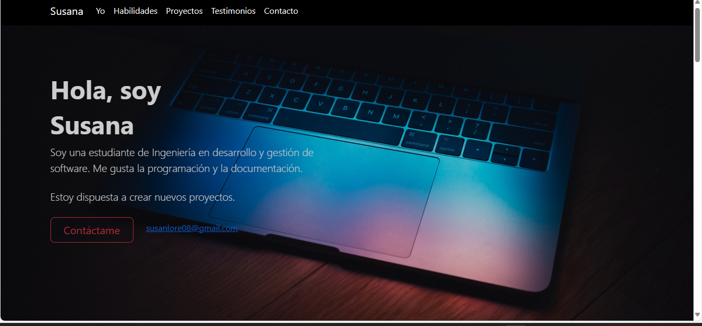
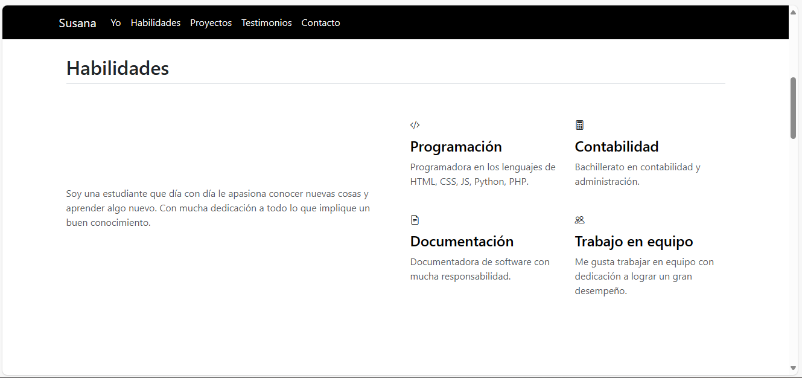
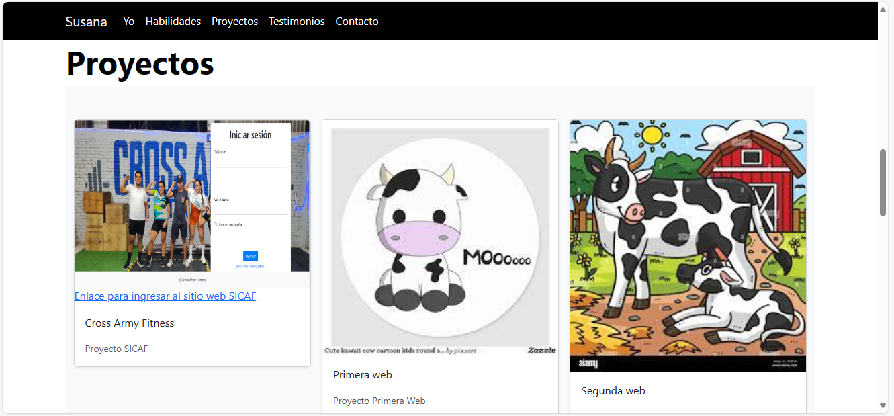
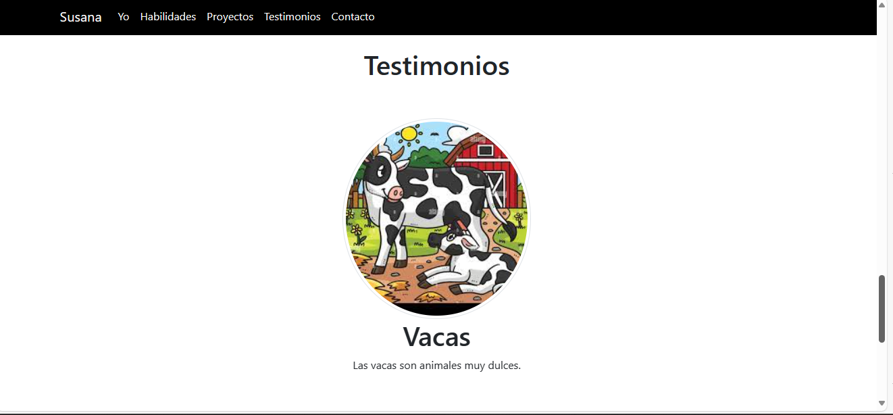
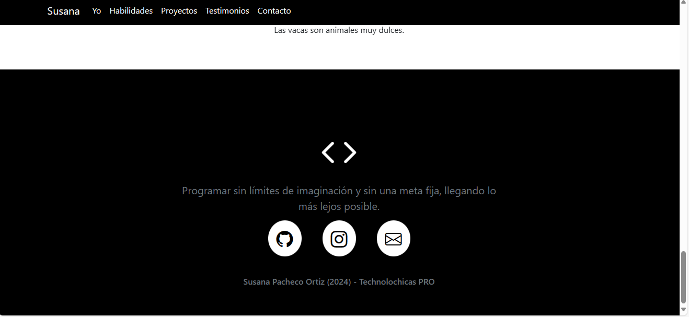

# Mi Portafolio de Tchnolochicas PRO

Este protfolio es desarrollado para poner en práctica las habilidades obtenidas dentro del bootcamp de desarrollo frontend.
Fue desarrollado con HTML, CSS Y JS con el uso de framework Boorstrap utilizando animaciones de bibliotecas externas.

[Proyecto en linea] (https://susey21.netlify.app/)

- Capturas de pantalla

- Tecnologías 

• HTML
• CSS
• Javascript
• Bootstrap 5

Ocupamos bibliotecas extra.

Creado por Malinali en el bootcamp de Technolochicas PRO.

